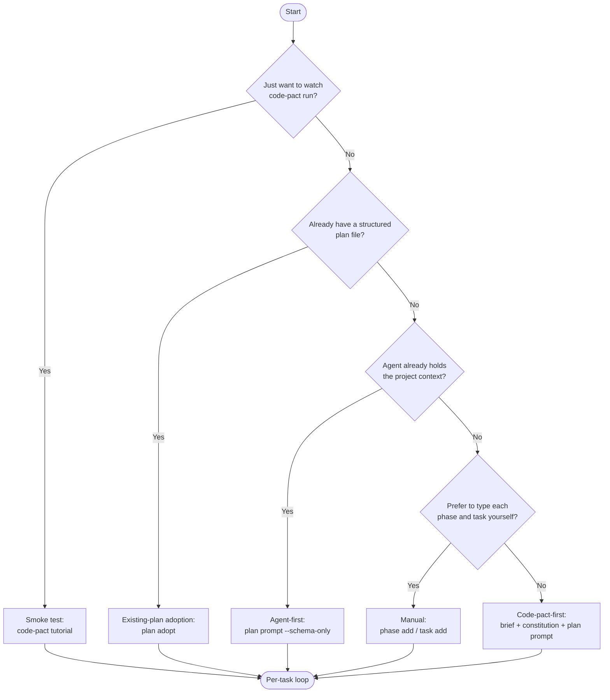

# Getting started

This guide takes you from an empty project to a successful `task complete` in about thirty minutes. It documents **several onboarding approaches** side by side so you can pick the one that matches how your roadmap comes into being.

If you only want a sixty-second overview of what `code-pact` is, read the [README](../README.md) first. If a term here is unfamiliar (context pack, envelope, derived state, …), the [glossary](glossary.md) defines them in plain language.

## Prerequisites

- Node.js **22 or newer** (LTS or current)
- A terminal where you can run `npm install` / `npm exec`; teams and CI should use the pinned devDependency path below
- One of the supported agents: `claude-code`, `codex`, or `generic` (Stable). `cursor` and `gemini-cli` work but are Experimental.

## Install

```sh
# Recommended for teams & CI: pin an exact version in your devDependencies
npm install --save-dev --save-exact code-pact@<version>
npm exec -- code-pact --version   # runs the project-local pinned binary

# One-off / individual use: global install
npm install -g code-pact
code-pact --version

# One-off / individual use only: run without installing
npx code-pact --version
```

For teams and CI, pin code-pact to an **exact** version in your `devDependencies` (`--save-exact`) so every contributor and every pipeline run resolves the same CLI — code-pact's contract and `state/progress.yaml` semantics evolve across versions, so a floating `@latest` (or even a `^` range) can change behaviour between runs. Commit `package.json` and your lockfile so CI and contributors resolve the same version. The global install and `npx` paths are fine for a quick look or individual use; the [CI guide](workflows/ci.md)'s GitHub Actions example pins the version explicitly for the same reason.

> The command examples in the rest of this guide are written as bare `code-pact …` for brevity. If you used the pinned `devDependency` path above, run them through your package runner — `npm exec -- code-pact …` (or via an `npm` script) — so they resolve the project-local pinned binary.

`code-pact@alpha` remains available for projects intentionally pinned to pre-v1.0 behaviour. New projects should pin an exact version from the current stable release line rather than the legacy `alpha` tag.

## Choose your path

Pick the approach that matches how your roadmap comes into being. They all converge on the same per-task agent loop (described at the end), so switching later is cheap.



| Approach | When to use it | Time to first `task complete` |
| --- | --- | --- |
| **Smoke test** ([tutorial](#path-1--tutorial)) | You just want to watch the loop run end to end — `code-pact tutorial` writes nothing to your repo. | ~1 minute |
| **Agent-first** ([schema-only prompt](#path-3--ai-assisted)) | Your agent (Claude Code, …) already holds the project context and can emit a roadmap YAML directly. | ~10 minutes |
| **Existing-plan adoption** ([`plan adopt`](#existing-plan-adoption--plan-adopt)) | You already have a structured plan — a `roadmap.md`, `TODO.md`, `tasks.md`, or a draft YAML — and want to ingest it deterministically. | ~5 minutes |
| **Code-pact-first** ([brief → prompt](#path-3--ai-assisted)) | Starting from scratch: capture a brief + constitution, then have an agent draft the full roadmap from them. | ~20 minutes |
| **Manual** ([by hand](#path-2--manual)) | You want precise control and prefer to type each phase and task yourself. | ~15 minutes |

Most agent users want **Agent-first** or **Existing-plan adoption**: the agent (or a plan it already produced) does the planning, and code-pact ingests the result deterministically — no second AI round-trip just to reshape it.

---

## Path 1 — Tutorial

> [!TIP]
> Brand new to code-pact? Start here. `code-pact tutorial` runs the whole loop in a throwaway sandbox and writes nothing to your repo.

Fastest way to confirm your install is healthy and watch the per-task loop run end to end. There are two ways to do it.

### Option A — `code-pact tutorial` (nothing is written to your project)

```sh
code-pact tutorial
```

Runs an **end-to-end smoke loop** — `init` → `task prepare` → `task start` → `task complete` (which runs verification internally) → `task finalize` — plus the cross-task dependency gate, inside a throwaway sandbox, narrating each step in plain language, then deletes the sandbox. Nothing touches your repo. Add `--keep` to leave the sandbox on disk for inspection, or `--json` for a machine-readable transcript.

This is the recommended smoke test: zero setup, zero cleanup. It does not call standalone `verify` (that runs inside `task complete`); for the command-by-command canonical loop, including the optional standalone `verify`, see Option B and [per-task-loop.md](per-task-loop.md).

### Option B — scaffold a real sample phase (`--sample-phase`)

If you would rather poke at a real phase inside your own repo, opt in with the `--sample-phase` flag:

```sh
code-pact init --sample-phase
# CI / non-TTY equivalent:
code-pact init --non-interactive --agent claude-code --locale en-US --sample-phase
```

> The interactive `init` wizard does not create the sample phase — pass `--sample-phase` explicitly, or use `code-pact tutorial` above to just watch the loop.

This writes the `TUTORIAL` phase into `design/`. It ships two minimal tutorial tasks; TUTORIAL-T2 declares `depends_on: [TUTORIAL-T1]` so you can demo the dependency field + the `task runbook` blocking-step output. Then walk [the per-task loop](per-task-loop.md) by hand — the same canonical sequence that page describes:

```sh
# TUTORIAL-T1: prepare → start → (implement) → verify → complete → finalize.
code-pact task prepare TUTORIAL-T1 --agent claude-code --json
code-pact task start TUTORIAL-T1 --agent claude-code
code-pact verify --phase TUTORIAL --task TUTORIAL-T1

# Optional dependency demo: TUTORIAL-T2 is still blocked until T1 is done.
code-pact task runbook TUTORIAL-T2 --json

code-pact task complete TUTORIAL-T1 --agent claude-code
code-pact task finalize TUTORIAL-T1 --json          # preview (dry-run is the default)
code-pact task finalize TUTORIAL-T1 --write --json  # apply

# TUTORIAL-T2 depends on TUTORIAL-T1 — repeat once T1 is done.
code-pact task prepare TUTORIAL-T2 --agent claude-code --json
code-pact task start TUTORIAL-T2 --agent claude-code
code-pact verify --phase TUTORIAL --task TUTORIAL-T2
code-pact task complete TUTORIAL-T2 --agent claude-code
code-pact task finalize TUTORIAL-T2 --json
code-pact task finalize TUTORIAL-T2 --write --json

# Phase-level read-only guidance, any time:
code-pact phase runbook TUTORIAL --json
```

If `pnpm test` is not the right verification command for your repo, pass a different one to `init` (`node --version` is a safe placeholder for a smoke test).

> [!NOTE]
> **The dependency demo** (the `task runbook TUTORIAL-T2` line above, run before T1 is done): the first step in `data.next_steps[]` is a blocking `manual_action` ("Wait for TUTORIAL-T1 to reach derived state: done") — the same gate `code-pact tutorial` shows automatically.

<details>
<summary>Notes on the sample phase</summary>

- `task finalize` / `phase reconcile` are optional — you can flip `status` by hand; they exist to mechanize it in release-prep PRs. `task runbook` / `phase runbook` are read-only and never execute anything. See [`concepts/finalization-reconciliation.md`](concepts/finalization-reconciliation.md) and [`concepts/runbook.md`](concepts/runbook.md).
- The artifact is named `TUTORIAL — Walkthrough` and exists only to confirm the project structure and verification pipeline. Delete it (`design/phases/TUTORIAL-walkthrough.yaml` plus the roadmap entry) once you have real phases — see [`concepts/sample-phase.md`](concepts/sample-phase.md).

</details>

---

## What `init` creates

`code-pact init` scaffolds a small, readable `design/` directory — the **active
control plane** for your project. Nothing else is generated; everything below is
meant to be edited or deleted as your project takes shape.

| Path | What it is | Edit or delete? |
| --- | --- | --- |
| `design/roadmap.yaml` | The ordered list of phases. Starts empty; `phase add` / `phase import` fill it. | Edit (grows as you plan) |
| `design/phases/` | One YAML file per phase, holding its tasks. Empty at init. | Grows with your plan |
| `design/decisions/` | ADRs for `requires_decision` tasks. Empty until you need one. | Add when a task needs a recorded decision |
| `design/rules/` | Project conventions injected into agent context packs. | Edit |
| `design/rules/coding-style.md` | A **starter example** rule, with `tags` / `applies_to` frontmatter showing how rules target task types. | Edit to fit your project, or delete if unused |
| `design/constitution.md` | Placeholder principles every decision should respect. `plan constitution` rewrites it. | Edit (or run `plan constitution`) |

`design/brief.md` is **not** created by `init`. It is optional — useful when you
plan with `plan prompt` / `plan brief`, unnecessary when adopting an existing
roadmap or working by hand. `doctor` only nudges for it once the project has a
real (non-tutorial) phase.

Generated, non-design state lives elsewhere: progress events in
`.code-pact/state/`, agent instruction files at the repo root (e.g. `CLAUDE.md`),
and maintainer evidence under `docs/maintainers/measurements/`.

## Path 2 — Manual

Use this path when you already know the shape of your roadmap. You will write each phase and task yourself, mixing interactive and flag-based commands.

```sh
# 1. Initialize. You can run the wizard interactively or skip it entirely.
#    Either works; the non-interactive form is shown so you can see the
#    full flag surface.
code-pact init --non-interactive --agent claude-code --locale en-US

# 2. Capture the project's intent. These wizards write design/brief.md
#    and design/constitution.md respectively.
code-pact plan brief
code-pact plan constitution

# 3. Add the first phase with flags (skip the wizard).
code-pact phase add \
  --id P1 \
  --name "Foundation" \
  --weight 20 \
  --objective "Establish the project foundation" \
  --verify-command "pnpm test"

# 4. Add a task to the phase. TWO paths:
#
#    (a) Interactive (TTY wizard):
code-pact task add P1
#
#    (b) Non-interactive (`--description` triggers flag-driven mode):
code-pact task add P1 \
  --description "Login form" \
  --type feature \
  --ambiguity medium \
  --risk low \
  --depends-on P1-T0 \
  --read "src/auth/**" \
  --write "src/handlers/login.ts" \
  --json

# 5. Generate the per-agent instruction files. The wizard in step 1 can
#    do this for you; this is the standalone command for later use.
code-pact adapter install claude-code

# 6. Then run the per-task loop — see per-task-loop.md.
```

Multi-word verification commands must be quoted, otherwise the trailing tokens raise `CONFIG_ERROR`:

```sh
# Correct
code-pact phase add ... --verify-command "node --version"

# Rejected — the trailing token would be silently lost
code-pact phase add ... --verify-command node --version
```

<details>
<summary>Scripted / CI setup (non-interactive)</summary>

Every wizard step has a non-interactive equivalent. `plan brief` / `plan constitution` accept `--from-file <yaml>`, `--stdin`, or flags; `task add` takes `--description` + readiness flags; `phase import` bulk-loads a YAML roadmap. A fully scripted bootstrap:

```sh
code-pact init --non-interactive --agent claude-code --locale en-US --json
code-pact plan brief \
  --what "What we're building" \
  --who  "Who it's for" \
  --differentiator "What makes it different" \
  --json
code-pact plan constitution \
  --description "Project description" \
  --principle "First principle" \
  --principle "Second principle" \
  --json
# ... then phase add / task add / adapter install as in step 3+.
```

These modes also clear the `BRIEF_MISSING` / `CONSTITUTION_PLACEHOLDER` warnings a non-interactive `init` otherwise leaves. See [`docs/maintainers/operations.md` § Non-interactive `plan brief` / `plan constitution`](maintainers/operations.md#non-interactive-plan-brief--plan-constitution-v16-p17) and `docs/cli-contract.md` for the envelope shapes.

</details>

---

## Path 3 — AI-assisted

`code-pact` never calls an LLM. It builds prompts you hand to your agent and ingests the YAML the agent returns. There are two ways in, depending on whether the project context already lives in your agent session.

### Agent-first — `plan prompt --schema-only`

Use this when your agent (Claude Code, Codex, …) already holds the project context and only needs the output shape fixed. No brief or constitution required.

```sh
# 1. Initialize.
code-pact init --non-interactive --agent claude-code --locale en-US

# 2. Emit a short, context-free prompt that only fixes the YAML output
#    shape (it does not read brief.md / constitution.md).
code-pact plan prompt --schema-only
#    Ask your agent to emit the roadmap in that format and save its reply
#    as draft-roadmap.yaml (raw YAML, no Markdown fences).

# 3. Ingest the YAML deterministically.
code-pact phase import draft-roadmap.yaml --json

# 4. Install the adapter, then run the per-task loop (see per-task-loop.md).
code-pact adapter install claude-code
```

### Code-pact-first — brief + constitution + `plan prompt`

Use this when you're starting from scratch and want code-pact to capture intent first, so the planning prompt is grounded in a brief and constitution.

```sh
# 1. Initialize.
code-pact init

# 2. Capture the project's intent so the planning prompt has something
#    to ground itself in.
code-pact plan brief
code-pact plan constitution

# 3. Generate the planning prompt and hand it to your agent.
code-pact plan prompt > planning-prompt.txt
#    Open planning-prompt.txt in your agent and ask it to produce a
#    YAML roadmap. Save the agent's reply as draft-roadmap.yaml.

# 4. Bulk-import the agent-generated roadmap. The lenient mode fills
#    in optional task fields with defaults and reports what it filled.
code-pact phase import draft-roadmap.yaml
#    Add --strict to require every field explicitly.
code-pact phase import draft-roadmap.yaml --strict

# 5. Install the adapter for the agent that will implement the tasks.
code-pact adapter install claude-code

# 6. Then run the per-task loop — see per-task-loop.md.
```

The lenient `phase import` mode is intentional. It lets the AI focus on getting `id`s right and trust `code-pact` to fill in the rest; you can audit the filled-in defaults in the JSON response or by running `code-pact plan lint --json`.

> **TTY required for the brief / constitution wizards.** `plan brief` and `plan constitution` are interactive and need a TTY (or use their `--from-file` / `--stdin` / flag forms — see the Manual path's CI note). `plan prompt` runs fine without them, and `plan prompt --schema-only` ignores them entirely. The code-pact-first flow is feasible without ever running the wizards, but you give the AI less to ground on.

---

## Existing-plan adoption — `plan adopt`

Already have a plan? If you hold a structured `roadmap.md` / `TODO.md` / `tasks.md` (task bullets under headings) or a draft phase YAML, `plan adopt` converts it into phases and tasks deterministically — no AI round-trip to reshape it.

```sh
# 1. Initialize.
code-pact init --non-interactive --agent claude-code --locale en-US

# 2. Dry-run: prints the phase-import YAML it WOULD create. Review it —
#    plan adopt does no semantic filtering.
code-pact plan adopt roadmap.md --json

# 3. Apply it (creates the phase(s) and tasks).
code-pact plan adopt roadmap.md --write --json

# 4. Validate, install the adapter, then run the per-task loop (see per-task-loop.md).
code-pact plan lint --include-quality --json
code-pact adapter install claude-code
```

`plan adopt` targets **structured** plans. Bullets in a "Risks" / "Non-goals" list are picked up as tasks too, so always review the dry-run before `--write`. A **narrative** roadmap whose tasks live in prose or fenced code blocks returns `no_plan_items_detected` — for those, use the **Agent-first** flow above and let the agent emit YAML. See [`docs/cli-contract.md`](cli-contract.md) for the full detection order and advisory codes.

---

## The per-task agent loop

Once you have at least one task, every path converges on the same deterministic loop:

```text
task prepare → task start → implement → verify → task complete → task finalize
```

[`docs/per-task-loop.md`](per-task-loop.md) is the canonical reference — the lifecycle diagram, every verb (and whether it records an event), a worked example, and the invariants (`start` / `complete` are idempotent; a `blocked` task cannot complete until resumed; `task complete` records progress but never mutates `design/`). `task prepare` is the entry point; `recommend` and `task context` remain available as standalone diagnostics that `task prepare` bundles for you.

## Checkpoints at phase / PR boundaries

```sh
code-pact plan lint --json          # schema + naming + reference checks
code-pact plan normalize --check    # whitespace/newline drift (--write to apply)
code-pact plan analyze --json       # design status vs progress-log drift
code-pact doctor --json             # human-friendly project health check
code-pact validate                  # CI-friendly, exit 1 on errors
```

Both `plan lint` and `plan analyze` accept `--strict` to fail on warnings. `plan normalize --write` preserves YAML comments and Markdown hard line breaks.

## Going further

The essentials above get you through your first task. These are the next things to reach for — each has its own page:

- **Optional task readiness fields** (`depends_on` / `reads` / `writes` / `decision_refs` / `acceptance_refs`) — declare a task's dependencies and read/write surface to shape its context pack. Fully optional. → [concepts/task-readiness-fields.md](concepts/task-readiness-fields.md)
- **Concurrent runs & the write lock** — what `LOCK_HELD` means and how to recover. → [troubleshooting.md § `LOCK_HELD`](troubleshooting.md#lock_held-from-a-design-mutating-command-v15) · [concepts/governance.md](concepts/governance.md)
- **Importing a Spec Kit plan** (`tasks.md` / `spec.md`) — the read-only one-way bridge. → [spec-kit-bridge.md](spec-kit-bridge.md)
- **Managing adapters over time** (`adapter upgrade`, drift) — after the one-time install. → [upgrading.md](upgrading.md)

## Next reading

- [`docs/cli-contract.md`](cli-contract.md) — full flag / exit code / JSON envelope / error code reference and the Stability taxonomy.
- [`docs/troubleshooting.md`](troubleshooting.md) — diagnostic code → recovery action for the most common error codes.
- [`docs/upgrading.md`](upgrading.md) — how to upgrade an existing project.
- [`docs/concepts/governance.md`](concepts/governance.md) — the governance layer (advisory write lock, reserved ids, roadmap mutation policy).
- [`docs/spec-kit-bridge.md`](spec-kit-bridge.md) — the read-only one-way importer for Spec Kit `tasks.md` / `spec.md` / `plan.md`.
