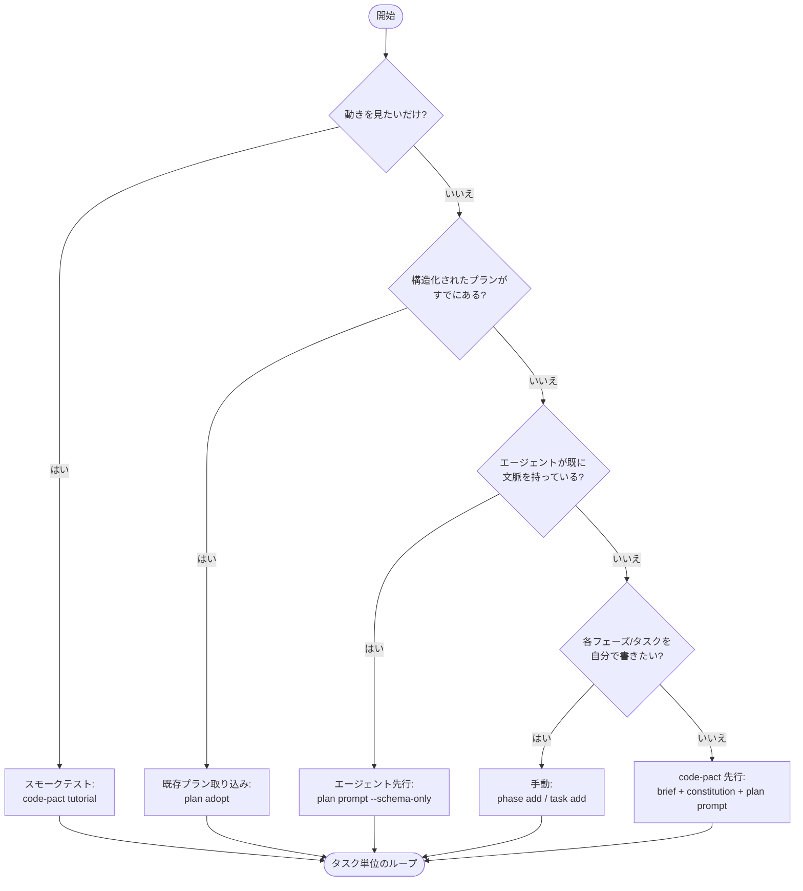

# はじめに

このドキュメントは、空のプロジェクトから最初の `task complete` を成功させるまでを約30分でたどるためのガイドです。ロードマップの作られ方に合わせて、いくつかの導入アプローチを並べて説明します。自分のやり方に合うものを選んでください。

> 日本語で読めるドキュメントの一覧は [docs/ja/](README.md) にあります。現在この `getting-started.md`、[タスク単位のループ](per-task-loop.md)、[用語集](glossary.md)、[ワークフローガイド](workflows/greenfield.md)（ゼロから / 既存に導入）が日本語で用意されています。それ以外（`docs/cli-contract.md`、`docs/troubleshooting.md`、`docs/dogfood.md` など）は英語が一次資料です。
>
> 60秒で `code-pact` の概要だけ知りたい場合は、まず英語の [README](../../README.md) を読むことをおすすめします。用語が分からないときは [用語集](glossary.md) を参照してください。

## 前提

- Node.js **22 以上**（LTS または current）
- `npm install` / `npm exec` を実行できるターミナル。チームと CI では、下記の pin した `devDependency` 経路を使ってください
- サポートされているエージェントのいずれか：`claude-code`、`codex`、`generic`（いずれも Stable）。`cursor` と `gemini-cli` も動作しますが Experimental です。

## インストール

```sh
# チーム & CI 推奨: devDependencies に正確なバージョンを pin する
npm install --save-dev --save-exact code-pact@<version>
npm exec -- code-pact --version   # プロジェクトローカルの pin したバイナリを実行

# 単発 / 個人利用: グローバルインストール
npm install -g code-pact
code-pact --version

# 単発 / 個人利用のみ: インストールせずに実行
npx code-pact --version
```

チームと CI では、code-pact を `devDependencies` に **正確な**バージョンで pin してください（`--save-exact`）。code-pact のコントラクトや `state/progress.yaml` のセマンティクスはバージョン間で進化するため、floating な `@latest`（あるいは `^` レンジでも）は実行ごとに挙動が変わりえます。`package.json` と lockfile をコミットして、CI とコントリビューターが同じバージョンを解決するようにしてください。グローバルインストールと `npx` の経路は、ちょっとした確認や個人利用には十分です。[CI ガイド](workflows/ci.md)の GitHub Actions 例も、同じ理由でバージョンを明示的に pin しています。

> このガイドの以降のコマンド例は、簡潔さのため bare な `code-pact …` で書いています。上記の pin した `devDependency` の経路を使う場合は、パッケージランナー経由で実行してください — `npm exec -- code-pact …`（または `npm` スクリプト経由）—— プロジェクトローカルの pin したバイナリが解決されます。

v1.0 より前の挙動に意図的に固定したプロジェクトでは `code-pact@alpha` も引き続き使えます。新規プロジェクトは、レガシーな `alpha` タグではなく、現行の安定リリースラインから正確なバージョンを pin してください。

## どの経路を選ぶか

ロードマップの作られ方に合わせてアプローチを選びます。いずれも最終的に同じタスク単位のループ（ドキュメント末尾で説明）に合流するので、後から切り替えるのも容易です。



| アプローチ | 向いている場面 | 最初の `task complete` までの目安 |
| --- | --- | --- |
| **スモークテスト**（チュートリアル） | ループの動きをひととおり見たいだけ — `code-pact tutorial` はリポジトリに何も書き込みません | 約1分 |
| **エージェント先行**（schema-only プロンプト） | エージェント（Claude Code など）がすでにプロジェクト文脈を持っていて、ロードマップ YAML を直接出力できる | 約10分 |
| **既存プランの取り込み**（`plan adopt`） | すでに構造化された `roadmap.md` / `TODO.md` / `tasks.md` や YAML 草案があり、決定論的に取り込みたい | 約5分 |
| **code-pact 先行**（brief → prompt） | ゼロから始める。brief と constitution を記録してから、それを元にエージェントにロードマップを起こさせる | 約20分 |
| **手動** | 細かく制御したく、各フェーズとタスクを自分で書きたい | 約15分 |

エージェント利用者の多くは **エージェント先行** か **既存プランの取り込み** が向いています。計画はエージェント（またはエージェントが既に出した計画）が担い、code-pact はその結果を決定論的に取り込む — 形を直すためだけの2回目の AI 往復は不要です。

---

## 経路 1 — チュートリアル

インストールが健全であること、そしてタスク単位のループが通ることをいちばん速く確認する経路です。やり方は2通りあります。

### 方法A — `code-pact tutorial`（プロジェクトには何も書き込みません）

```sh
code-pact tutorial
```

`init` → `task prepare` → `task start` → `task complete`（検証は内部で走ります）→ `task finalize` という **end-to-end のスモークループ**と、タスク間の依存ゲートまでを使い捨てのサンドボックスで実行し、各ステップを平易に解説したうえでサンドボックスを削除します。あなたのリポジトリには一切触れません。`--keep` でサンドボックスを残して中身を確認でき、`--json` で機械可読のトランスクリプトが得られます。

準備も後片付けも不要で、おすすめの動作確認方法です。standalone の `verify` は個別に実行しません（検証は `task complete` の中で走ります）。コマンド単位の正典ループ（任意の standalone `verify` を含む）は方法Bと [per-task-loop.md](per-task-loop.md) を参照してください。

### 方法B — 実際のサンプルフェーズを作る（`--sample-phase`）

自分のリポジトリ内で実物のフェーズをいじってみたい場合は、`--sample-phase` フラグで明示的に作成します:

```sh
code-pact init --sample-phase
# CI / 非対話の場合:
code-pact init --non-interactive --agent claude-code --locale en-US --sample-phase
```

> 対話的な `init` ウィザードは、サンプルフェーズを作るかどうかをもう尋ねません（v1.15 で削除）。`--sample-phase` を明示的に指定するか、上記の `code-pact tutorial` でループを眺めてください。

これは `design/` に `TUTORIAL` フェーズ（`TUTORIAL-T1` と `TUTORIAL-T2`）を書き出します。`TUTORIAL-T2` は `depends_on: [TUTORIAL-T1]` を宣言しているので、依存フィールドと `task runbook` のブロッキング表示を試せます。あとは手で [タスク単位のループ](per-task-loop.md) を回します（各コマンドの意味はそのページを参照）:

```sh
# TUTORIAL-T1: prepare → start →（実装）→ verify → complete → finalize。
code-pact task prepare TUTORIAL-T1 --agent claude-code --json
code-pact task start TUTORIAL-T1 --agent claude-code
code-pact verify --phase TUTORIAL --task TUTORIAL-T1

# 任意の依存デモ: TUTORIAL-T1 が done になるまで TUTORIAL-T2 はブロックされる。
code-pact task runbook TUTORIAL-T2 --json

code-pact task complete TUTORIAL-T1 --agent claude-code
code-pact task finalize TUTORIAL-T1 --json          # プレビュー（既定は dry-run）
code-pact task finalize TUTORIAL-T1 --write --json  # 適用

# TUTORIAL-T2 は TUTORIAL-T1 に依存 — T1 が done になったら繰り返す。
code-pact task prepare TUTORIAL-T2 --agent claude-code --json
code-pact task start TUTORIAL-T2 --agent claude-code
code-pact verify --phase TUTORIAL --task TUTORIAL-T2
code-pact task complete TUTORIAL-T2 --agent claude-code
code-pact task finalize TUTORIAL-T2 --json
code-pact task finalize TUTORIAL-T2 --write --json

# フェーズ単位の読み取り専用ガイダンスはいつでも:
code-pact phase runbook TUTORIAL --json
```

`pnpm test` がこのリポジトリにふさわしくない場合は、`init` に別のコマンドを渡してください。スモークテスト目的なら `node --version` のようなコマンドも安全な選択肢です。

> サンプルフェーズの成果物は `TUTORIAL — Walkthrough`（v1.4+）で、プロジェクト構造と検証パイプラインの確認のためだけに存在します。本物のフェーズができたら、ファイル `design/phases/TUTORIAL-walkthrough.yaml` と roadmap のエントリを削除してください。サンプルフェーズの詳細は [`docs/concepts/sample-phase.md`](../concepts/sample-phase.md) で扱っています。

---

## 経路 2 — 手動

ロードマップの形がすでに見えているときの経路です。各フェーズとタスクを自分で書き、対話的なコマンドとフラグベースのコマンドを混ぜて使います。

```sh
# 1. 初期化。対話で進めても、ウィザードを完全にスキップしても構いません。
#    どちらでも動きますが、ここではフラグサーフェスを示すために非対話形式で示します。
code-pact init --non-interactive --agent claude-code --locale en-US

# 2. プロジェクトの意図を記録します。これらのウィザードは
#    design/brief.md と design/constitution.md をそれぞれ書き出します。
code-pact plan brief
code-pact plan constitution

# 3. フラグでフェーズを追加します（ウィザードをスキップ）。
code-pact phase add \
  --id P1 \
  --name "Foundation" \
  --weight 20 \
  --objective "Establish the project foundation" \
  --verify-command "pnpm test"

# 4. フェーズにタスクを追加します（対話）。
code-pact task add P1

# 5. エージェント別の指示ファイルを生成します。手順1のウィザードでも
#    生成できます。これは後でエージェントを変えたときに使う単体コマンドです。
code-pact adapter install claude-code

# 6. このあとタスク単位のループへ — per-task-loop.md を参照。
```

複数語からなる検証コマンドはクオートで囲んでください。囲まないと末尾のトークンが `CONFIG_ERROR` を引き起こします。

```sh
# 正しい
code-pact phase add ... --verify-command "node --version"

# 拒否される — 末尾のトークンが黙って失われる
code-pact phase add ... --verify-command node --version
```

---

## 経路 3 — AI 支援

`code-pact` 自身が LLM を呼ぶことはありません。あなたのエージェントに渡すプロンプトを組み立て、エージェントが返す YAML を取り込みます。プロジェクト文脈がすでにエージェントのセッションにあるかどうかで、入口が2通りあります。

### エージェント先行 — `plan prompt --schema-only`

エージェント（Claude Code、Codex など）がすでにプロジェクト文脈を持っていて、出力の形だけ固定すればよいときに使います。brief や constitution は不要です。

```sh
# 1. 初期化。
code-pact init --non-interactive --agent claude-code --locale en-US

# 2. brief.md / constitution.md を読まず、YAML の出力形式だけを固定する
#    短いプロンプトを出力します。
code-pact plan prompt --schema-only
#    その形式でロードマップを出力させ、返答を draft-roadmap.yaml として
#    保存します（生の YAML、Markdown のコードフェンスなし）。

# 3. 決定論的に取り込みます。
code-pact phase import draft-roadmap.yaml --json

# 4. アダプタを入れて、タスク単位のループへ — per-task-loop.md を参照。
code-pact adapter install claude-code
```

### code-pact 先行 — brief + constitution + `plan prompt`

ゼロから始め、先に code-pact に意図を記録させて、計画用プロンプトを brief と constitution に地盤づけたいときに使います。

```sh
# 1. 初期化。
code-pact init

# 2. プロジェクトの意図を記録し、計画用プロンプトに地盤を与えます。
code-pact plan brief
code-pact plan constitution

# 3. 計画用プロンプトを生成し、自分のエージェントに渡します。
code-pact plan prompt > planning-prompt.txt
#    planning-prompt.txt をエージェントで開き、YAML 形式のロードマップを
#    出力するよう指示します。返答を draft-roadmap.yaml として保存します。

# 4. エージェントが生成したロードマップを一括インポートします。
#    lenient モードは task の optional フィールドをデフォルトで埋め、
#    何を埋めたかを結果に報告します。
code-pact phase import draft-roadmap.yaml
#    すべてのフィールドを明示させたい場合は --strict を付けます。
code-pact phase import draft-roadmap.yaml --strict

# 5. 実装を担当するエージェント向けのアダプタをインストールします。
code-pact adapter install claude-code

# 6. このあとタスク単位のループへ — per-task-loop.md を参照。
```

`phase import` の lenient モードは意図的な設計です。AI には `id` を正しく出すことに集中させ、残りは `code-pact` が埋めるという分担にできます。埋められたデフォルトは JSON レスポンス、または `code-pact plan lint --json` で監査できます。

---

## 既存プランの取り込み — `plan adopt`

すでに計画がありますか。構造化された `roadmap.md` / `TODO.md` / `tasks.md`（見出しの下にタスクの箇条書き）やフェーズ YAML の草案があるなら、`plan adopt` がそれを決定論的にフェーズとタスクへ変換します。形を直すための AI 往復は不要です。

```sh
# 1. 初期化。
code-pact init --non-interactive --agent claude-code --locale en-US

# 2. dry-run: 作成される phase-import YAML を表示するだけ。確認してください。
#    plan adopt は意味的なフィルタリングをしません。
code-pact plan adopt roadmap.md --json

# 3. 適用します（フェーズとタスクを作成）。
code-pact plan adopt roadmap.md --write --json

# 4. 検証し、アダプタを入れて、タスク単位のループへ — per-task-loop.md を参照。
code-pact plan lint --include-quality --json
code-pact adapter install claude-code
```

`plan adopt` は **構造化された** プラン向けです。「リスク」「非目標」リストの箇条書きもタスクとして拾うため、`--write` の前に必ず dry-run を確認してください。タスクが散文や code fence の中にある **物語的な** ロードマップは `no_plan_items_detected` になります。その場合は上の **エージェント先行** を使い、エージェントに YAML を出させてください。検出順と advisory コードは [`docs/cli-contract.md`](../cli-contract.md) を参照。

---

## タスク単位のエージェントループ

タスクがひとつでもできれば、どのアプローチもすべて同じ決定論的なループに合流します:

```text
task prepare → task start → 実装 → verify → task complete → task finalize
```

[`docs/ja/per-task-loop.md`](per-task-loop.md) がこのループの正典リファレンスです — ライフサイクル図、各コマンド（とイベント記録の有無）、実例、不変条件（`start` / `complete` は冪等、`blocked` は resume するまで complete 不可、`task complete` は progress を記録するが `design/` には触れない）。`task prepare` が入口で、`recommend` と `task context` は `task prepare` が同梱する単体の診断としても使えます。

## フェーズや PR の境界でのチェックポイント

```sh
code-pact plan lint --json          # スキーマ・命名・参照チェック
code-pact plan normalize --check    # 空白・改行の drift（--write で適用）
code-pact plan analyze --json       # design status と progress ログの drift
code-pact doctor --json             # 人間が読むためのプロジェクトヘルスチェック
code-pact validate                  # CI 向け、エラーで exit 1
```

`plan lint` と `plan analyze` はいずれも `--strict` で warning を error に昇格できます。`plan normalize --write` は YAML コメントと Markdown のハードラインブレークを保ちます。

## さらに進む

最初のタスクを終えたら、次に手を伸ばすもの。それぞれ専用ページがあります。

- **任意のタスク readiness フィールド**（`depends_on` / `reads` / `writes` / `decision_refs` / `acceptance_refs`） — タスクの依存と read/write 面を宣言してコンテキストパックを形作る。完全に任意で、pre-v1.1 YAML は不変。→ [task-readiness-fields.md](../concepts/task-readiness-fields.md)（英語）
- **並行実行と write lock** — `LOCK_HELD` の意味と復旧方法。→ [troubleshooting.md](../troubleshooting.md#lock_held-from-a-design-mutating-command-v15)（英語）・[governance.md](../concepts/governance.md)（英語）
- **Spec Kit プランの取り込み**（`tasks.md` / `spec.md`） — 読み取り専用の一方向ブリッジ。→ [spec-kit-bridge.md](../spec-kit-bridge.md)（英語）
- **アダプタの継続運用**（`adapter upgrade`、drift） — 一度きりのインストール後。→ [upgrading.md](../upgrading.md)（英語）

## 次に読むもの

- [`docs/getting-started.md`](../getting-started.md) — このドキュメントの英語版。一次資料です。
- [`README.md`](../../README.md) — `code-pact` 全体の紹介とリファレンスへのリンクハブ（英語）。
- [`docs/cli-contract.md`](../cli-contract.md) — フラグ / 終了コード / JSON envelope / エラーコードの完全リファレンスと Stability taxonomy（英語）。
- [`docs/upgrading.md`](../upgrading.md) — アップグレード方法（v1.x 内は追加のみ。pre-v1.0 alpha の詳細は `migration.md` にアーカイブ）（英語）。
- [`docs/troubleshooting.md`](../troubleshooting.md) — 診断コードごとの復旧アクション（英語）。
