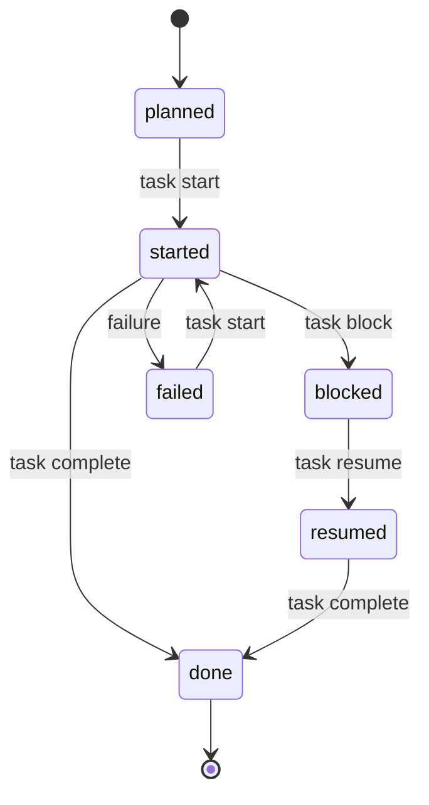

# タスク単位のループ

ロードマップがどう作られたかに関わらず、タスクの進め方はどれも同じです。このページがそのループの唯一の説明で、他のドキュメントは繰り返さずにここへリンクします。用語が分からないときは [用語集](glossary.md) を参照してください。

> 🌐 英語版: [per-task-loop.md](../per-task-loop.md)

## ライフサイクル

タスクは、追記専用の [`progress.yaml`](glossary.md#状態とタスク単位のループ) ログから code-pact が**導出する**状態を遷移します。イベントがまだ無いタスクは `planned` です。



`task complete` は、フェーズの検証コマンドが通って初めて `done` を記録します。`task finalize` は `done` の**後**に行う別サーフェスで、タスクの *design status*（意図）を *operational fact*（実際）に揃えます — progress イベントは追記しません。

許可される遷移の全体（決定論的な状態機械）:

| 現在 | 遷移先 | 経由 |
| --- | --- | --- |
| `planned` | `started` | `task start` |
| `started` | `done` / `blocked` / `failed` | `task complete` / `task block` / 失敗 |
| `blocked` | `resumed` / `failed` | `task resume` / 失敗 |
| `resumed` | `done` / `blocked` / `failed` | `task complete` / `task block` / 失敗 |
| `failed` | `started` | `task start`（再試行） |
| `done` | — | 終端（その後 `task finalize` が design status を整合） |

## 各コマンド

| ステップ | コマンド | 何をするか | イベント記録 |
| --- | --- | --- | --- |
| **prepare** | `task prepare <id> --agent <a> --json` | 単一の入口。現在の状態・推奨・コンテキストパックのメタデータ・構造化された `next_action`・次に実行すべき正確なコマンドの `commands` 辞書を返す。 | なし（読み取り専用） |
| **start** | `task start <id> --agent <a>` | `started` を記録。冪等 — 再実行は `already_started` を返す。 | `started` |
| *(実装)* | — | エージェント自身の作業。code-pact は動いていない。 | — |
| **verify** | `verify --phase <p> --task <id>` | フェーズの検証コマンドを実行（何も記録しない）。`complete` の事前確認。 | なし |
| **complete** | `task complete <id> --agent <a>` | 検証を再実行し、通れば `done` を追記。冪等 — 再実行は `already_done` を返す。 | `done`（成功時） |
| **finalize** | `task finalize <id> --write --json` | タスクの design status を `done` に揃え、宣言済み writes と実際の差分を監査。まず `--write` 無しでプレビュー。 | なし |

タスクが何かを待っている場合は、明示的に記録します:

| コマンド | 何をするか | イベント記録 |
| --- | --- | --- |
| `task block <id> --reason "…"` | 理由つきで `blocked` にする。 | `blocked` |
| `task resume <id> --agent <a>` | ブロックを解除し、`resumed` にする。 | `resumed` |

## 実例

```sh
# 1. prepare — 状態・推奨・次の正確なコマンドを読む。
code-pact task prepare P1-T1 --agent claude-code --json

# 2. start してから実装する。
code-pact task start P1-T1 --agent claude-code

# 3. (任意) complete の前に検証を事前確認。
code-pact verify --phase P1 --task P1-T1

# 4. complete — 検証を再実行し、通れば `done` を追記。
code-pact task complete P1-T1 --agent claude-code

# 5. finalize — まずプレビュー、その後 design status を done に。
code-pact task finalize P1-T1 --json
code-pact task finalize P1-T1 --write --json
```

## 知っておくと役立つ不変条件

- **`task start` と `task complete` は冪等。** すでに started / done のタスクに再実行すると、エラーではなく `already_started: true` / `already_done: true` を返す。
- **`blocked` のタスクは直接 complete できない。** `task resume` するまで `task complete` は `INVALID_TASK_TRANSITION` を返すので、ブロック解除の判断がイベントとして記録される。
- **`task complete` は progress を記録するが `design/` には触れない。** design の意図と operational fact は意図的に分離されている。整合させるのは `task finalize`（1 タスク）または `phase reconcile`（フェーズ全体）。ずれると `plan analyze` が `STATUS_DRIFT` 警告を出す。

各コマンドのフラグ・終了コード・envelope の完全なリファレンスは [cli-contract.md](../cli-contract.md)（英語）を参照してください。
