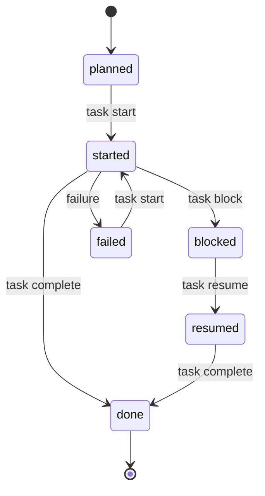

# The per-task loop

Whichever way your roadmap came into being, every task is worked the same way.
This page is the single description of that loop — other docs link here instead
of repeating it. New to the vocabulary? See the [glossary](glossary.md).

## The lifecycle

A task moves through states that code-pact **derives** from the append-only
[progress ledger](glossary.md#state-and-the-per-task-loop). With no events
yet, a task is `planned`.



`task complete` records `done` only after the phase's verification command
passes. `task finalize` happens **after** `done` and is a separate surface — it
flips the task's _design status_ (intent) to match the _operational fact_; it
does not add a progress event.

Full set of allowed transitions (the deterministic state machine):

| From      | Can move to                   | Via                                                      |
| --------- | ----------------------------- | -------------------------------------------------------- |
| `planned` | `started`                     | `task start`                                             |
| `started` | `done` / `blocked` / `failed` | `task complete` / `task block` / failure                 |
| `blocked` | `resumed` / `failed`          | `task resume` / failure                                  |
| `resumed` | `done` / `blocked` / `failed` | `task complete` / `task block` / failure                 |
| `failed`  | `started`                     | `task start` (retry)                                     |
| `done`    | —                             | terminal (then `task finalize` reconciles design status) |

## The verbs

| Step          | Command                                | What it does                                                                                                                                                                                              | Records an event?                                                                  |
| ------------- | -------------------------------------- | --------------------------------------------------------------------------------------------------------------------------------------------------------------------------------------------------------- | ---------------------------------------------------------------------------------- |
| **Prepare**   | `task prepare <id> --agent <a> --json` | The single entry point. Returns a minimal work order: task goal, read/write scope, done criteria, verification commands, decision status, a single `next` action, and a fallback command for full detail. | No — progress-read-only (does **not** write a context pack unless `--detail full`) |
| **Start**     | `task start <id> --agent <a>`          | Records `started`. Idempotent — a second call returns `already_started`.                                                                                                                                  | `started`                                                                          |
| _(implement)_ | —                                      | Your agent's own work. code-pact is not running.                                                                                                                                                          | —                                                                                  |
| **Verify**    | `verify --phase <p> --task <id>`       | Runs the phase's verification commands without recording anything. A pre-flight for `complete`.                                                                                                           | No                                                                                 |
| **Complete**  | `task complete <id> --agent <a>`       | Re-runs verification; appends `done` on pass. Idempotent — a second call returns `already_done`.                                                                                                          | `done` (on pass)                                                                   |
| **Finalize**  | `task finalize <id> --write --json`    | Flips the task's design status to `done`, and audits declared vs. actual writes. Run without `--write` first to preview.                                                                                  | No                                                                                 |

When `task complete --json --detail agent` fails, the loop remains finite:

1. Read the compact failure capsule.
2. Read `data.recommendation.repairPolicy` from the earlier `task prepare --json --detail full` result (or `recommend --json`).
3. If `repairPolicy.mode` is `disabled`, stop bounded repair and use the normal escalation guidance.
4. If it is `bounded` and the failure kind is `command_failed`, make one minimal repair using the same model, effort, and context.
5. Re-run the same `task complete` command.
6. If it passes, continue to `task finalize`.
7. If the same fingerprint recurs, or the repair attempt fails again, stop and move to `allowedEscalation`.

Timeouts, aborts, decision failures, unsafe writes, invalid state, and unknown
failures are not bounded-repair inputs. Code Pact reports the policy; it does
not run a retry worker, restart an agent, widen context, or add progress events
for repair attempts.

If a task is waiting on something, record it explicitly:

| Command                        | What it does                                  | Records an event? |
| ------------------------------ | --------------------------------------------- | ----------------- |
| `task block <id> --reason "…"` | Marks the task `blocked` with a reason.       | `blocked`         |
| `task resume <id> --agent <a>` | Clears the block; the task becomes `resumed`. | `resumed`         |

### Recording a `done` without `task complete`

`task record-done` records a `done` event **without** running the loop's
verification commands — the proof is the `--evidence` you supply. It is the
honest path for two cases:

1. **External completion** — work already merged, or not verifiable from the
   current working tree.
2. **The `record_only` lightweight lane** — when `task prepare`
   recommends `lifecycleMode: record_only` (a small, low-risk, strongly-verified
   docs/test task), you run the project's verification **yourself**, then record
   the result here. `record_only` is a lighter _loop_, **not** lighter
   verification.

| Command                                                        | What it does                                                                                                                                                                                                                        | Records an event?           |
| -------------------------------------------------------------- | ----------------------------------------------------------------------------------------------------------------------------------------------------------------------------------------------------------------------------------- | --------------------------- |
| `task record-done <id> --evidence "PR #123 · pnpm test green"` | Records `done` without running verification commands — the proof is `--evidence` (a PR, CI link, or the verification you ran). The event carries `source: external`. The decision gate still applies for `requires_decision` tasks. | `done` (`source: external`) |

When the work can be verified from the working tree and the recommendation's
`lifecycleMode` is not `record_only`, prefer the normal `complete` path (it runs verification for you).
`source: external` marks an event that did **not** go through `task complete`'s
loop verification — so later diagnostics can tell the two apart. Put real proof
in `--evidence`: a PR number, a CI result, or the verification command you ran.

## Experimental: one-shot execution with `task execute`

For eligible single-file tasks, `code-pact task execute <id> --executor-file <relative-project-path> [--agent <a>] [--timeout <ms>]` runs an external one-shot executor. The task must read and write a single existing source file, the git working tree must be clean, and the executor file must be a relative path to a regular, non-symlink, executable file inside the project. The executor is a trusted executable: it runs with `cwd` set to an OS temporary directory, a sanitized environment (known repository-path variables such as `PWD`, `INIT_CWD`, `npm_package_json`, etc. removed), and the same process privileges as code-pact. It is not an OS sandbox.

The external process receives a JSON input (schema version 1) with the task goal, `source_path`, source content, and verification command; it must emit either a `replace_exact` payload (`expected_file_sha256`, `old_text`, `new_text`) or a `blocked` reason. `new_text` may be empty to delete `old_text`. The runtime applies the replacement atomically, re-runs the verification command, and records `done` only when the working tree contains exactly the expected source-file change. On failure it rolls the source file back; if the working tree changes before the executor returns its response, the edit is rejected and the source is restored. All public failure reasons and path lists are bounded.

Public error codes for `task execute` are: `EDIT_REJECTED`, `EXECUTION_BLOCKED`, `EXECUTION_INELIGIBLE`, `EXECUTOR_FAILED`, `VERIFICATION_FAILED`, `ROLLBACK_FAILED`, `ROLLBACK_STALE_FILE`, `ROLLBACK_INCOMPLETE`, `WORKTREE_NOT_CLEAN`, `EXECUTOR_MUTATED_WORKTREE`, and `EXECUTION_SCOPE_VIOLATION`. Path lists are emitted as bounded summaries (`{ changed_path_count: number, changed_paths: string[], paths_truncated: boolean }`) and `VERIFICATION_FAILED` also carries a bounded `failure` projection.

## A worked example

```sh
# 1. Prepare — default minimal returns a compact work order (goal, scope, next action).
#    Use --detail full (or any budget flag) to also get the recommendation + commands.
code-pact task prepare P1-T1 --agent claude-code --json

# 1b. If you need the recommendation, context-pack metadata, or decision commitments:
code-pact task prepare P1-T1 --agent claude-code --detail full --json

# 2. Start, then implement the task.
code-pact task start P1-T1 --agent claude-code

# 3. (Optional) pre-flight verification before completing.
code-pact verify --phase P1 --task P1-T1

# 4. Complete — re-runs verification, appends `done` on pass.
code-pact task complete P1-T1 --agent claude-code

# 5. Finalize — preview first, then flip the design status to done.
code-pact task finalize P1-T1 --json
code-pact task finalize P1-T1 --write --json
```

> [!WARNING]
> `task finalize --write` mutates the phase YAML in `design/`. Run it without `--write` first to preview the change (dry-run is the default).

## Invariants worth knowing

- **`task start` and `task complete` are idempotent.** Re-running on an
  already-`started` / already-`done` task returns `already_started: true` /
  `already_done: true` instead of erroring.
- **A `blocked` task cannot complete directly.** `task complete` returns
  `INVALID_TASK_TRANSITION` until you `task resume`, so the unblock decision is
  captured as an event.
- **`task complete` records progress but does not touch `design/`.** Design
  intent and operational fact are kept separate on purpose. `task finalize`
  (one task) or `phase reconcile` (a whole phase) is what reconciles them. If
  they drift, `plan analyze` reports a `STATUS_DRIFT` warning.

For generated command usage, flags, and examples, see
[cli-reference.generated.md](cli-reference.generated.md). For exit codes,
JSON envelopes, error codes, and semantic guarantees, see
[cli-contract.md](cli-contract.md).
