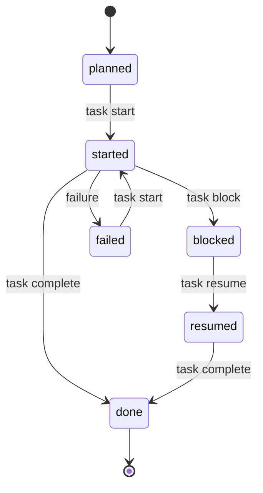

# The per-task loop

Whichever way your roadmap came into being, every task is worked the same way.
This page is the single description of that loop — other docs link here instead
of repeating it. New to the vocabulary? See the [glossary](glossary.md).

## The lifecycle

A task moves through states that code-pact **derives** from the append-only
[`progress.yaml`](glossary.md#state-and-the-per-task-loop) log. With no events
yet, a task is `planned`.



`task complete` records `done` only after the phase's verification command
passes. `task finalize` happens **after** `done` and is a separate surface — it
flips the task's *design status* (intent) to match the *operational fact*; it
does not add a progress event.

Full set of allowed transitions (the deterministic state machine):

| From | Can move to | Via |
| --- | --- | --- |
| `planned` | `started` | `task start` |
| `started` | `done` / `blocked` / `failed` | `task complete` / `task block` / failure |
| `blocked` | `resumed` / `failed` | `task resume` / failure |
| `resumed` | `done` / `blocked` / `failed` | `task complete` / `task block` / failure |
| `failed` | `started` | `task start` (retry) |
| `done` | — | terminal (then `task finalize` reconciles design status) |

## The verbs

| Step | Command | What it does | Records an event? |
| --- | --- | --- | --- |
| **Prepare** | `task prepare <id> --agent <a> --json` | The single entry point. Returns current state, the recommendation, context-pack metadata, a structured `next_action`, and a `commands` dictionary with the exact next commands. | No (read-only) |
| **Start** | `task start <id> --agent <a>` | Records `started`. Idempotent — a second call returns `already_started`. | `started` |
| *(implement)* | — | Your agent's own work. code-pact is not running. | — |
| **Verify** | `verify --phase <p> --task <id>` | Runs the phase's verification commands without recording anything. A pre-flight for `complete`. | No |
| **Complete** | `task complete <id> --agent <a>` | Re-runs verification; appends `done` on pass. Idempotent — a second call returns `already_done`. | `done` (on pass) |
| **Finalize** | `task finalize <id> --write --json` | Flips the task's design status to `done`, and audits declared vs. actual writes. Run without `--write` first to preview. | No |

If a task is waiting on something, record it explicitly:

| Command | What it does | Records an event? |
| --- | --- | --- |
| `task block <id> --reason "…"` | Marks the task `blocked` with a reason. | `blocked` |
| `task resume <id> --agent <a>` | Clears the block; the task becomes `resumed`. | `resumed` |

## A worked example

```sh
# 1. Prepare — read state + recommendation + the exact next commands.
code-pact task prepare P1-T1 --agent claude-code --json

# 2. Start, then implement the task.
code-pact task start P1-T1 --agent claude-code

# 3. (Optional) pre-flight verification before completing.
code-pact verify --phase P1 --task P1-T1

# 4. Complete — re-runs verification, appends `done` on pass.
code-pact task complete P1-T1 --agent claude-code

# 5. Finalize — preview first, then flip the design status to done.
code-pact task finalize P1-T1 --json
code-pact task finalize P1-T1 --write --json
```

> [!WARNING]
> `task finalize --write` mutates the phase YAML in `design/`. Run it without `--write` first to preview the change (dry-run is the default).

## Invariants worth knowing

- **`task start` and `task complete` are idempotent.** Re-running on an
  already-`started` / already-`done` task returns `already_started: true` /
  `already_done: true` instead of erroring.
- **A `blocked` task cannot complete directly.** `task complete` returns
  `INVALID_TASK_TRANSITION` until you `task resume`, so the unblock decision is
  captured as an event.
- **`task complete` records progress but does not touch `design/`.** Design
  intent and operational fact are kept separate on purpose. `task finalize`
  (one task) or `phase reconcile` (a whole phase) is what reconciles them. If
  they drift, `plan analyze` reports a `STATUS_DRIFT` warning.

For the full flag, exit-code, and envelope reference of every verb, see
[cli-contract.md](cli-contract.md).
